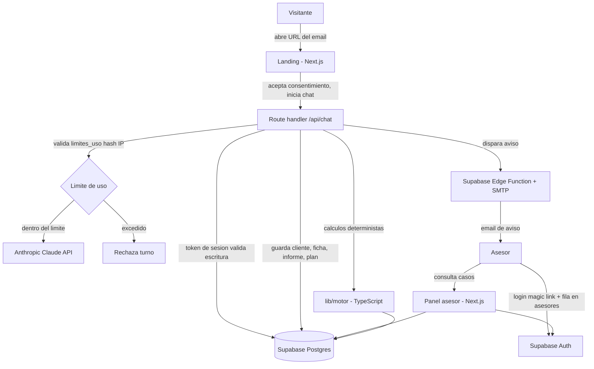

# Arquitectura técnica

<!-- Documento vivo. Actualizar cada vez que cambie el stack, la estructura de carpetas
     o cualquier decisión técnica relevante.
     Los cambios deben registrarse también en changelog/. -->

---

## Stack seleccionado

- **Next.js 14+ (App Router):** landing y chat en el mismo proyecto; Server Components para la
  landing estática, route handlers para el backend conversacional. Framework ya conocido por el
  usuario en otros proyectos.
- **Supabase (Postgres):** persistencia de conversaciones, fichas y diagnósticos (`M-04`), y base
  del panel del asesor (`S-01`). Proyecto ya creado: `ekuxwmktzasyxvziijdz.supabase.co`.
- **Supabase Auth:** login del asesor para el panel `S-01` (magic link a su email — no hace falta
  gestionar contraseñas para un único usuario). Los visitantes del chat **no** se autentican, por
  diseño (`WON'T` del PRD).
- **Supabase (Edge Function + SMTP) o Auth emails:** envío del aviso automático al asesor (`M-05`).
- **Anthropic Claude API:** motor conversacional. `instrucciones-sistema.md` (entrevista) e
  `instrucciones-motor.md` (análisis) se usan como system prompts. Requiere revisión antes de
  implementarse — ver "Decisiones técnicas relevantes".
- **Tailwind CSS:** estilos, alineado con la paleta y tipografía de `design-system.md`.
- **Vercel:** despliegue. El usuario ya tiene proyectos desplegados ahí (carpetas `TRABAJO CLASE`).

| Capa | Tecnología | Justificación |
|------|-----------|---------------|
| Framework | Next.js 14+ (App Router) | Landing + backend del chat en un solo proyecto, despliegue directo en Vercel |
| Base de datos | Supabase (Postgres) | Persistencia de fichas/diagnósticos, ya provisionado |
| Autenticación | Supabase Auth (magic link, solo asesor) | Un único usuario administrador; visitantes sin cuenta |
| IA conversacional | Anthropic Claude API | Las instrucciones ya existen en formato system prompt de Claude |
| Email transaccional | Supabase (Edge Function + SMTP) | Reutiliza infraestructura ya presente, sin dar de alta un servicio nuevo |
| Estilos | Tailwind CSS | Velocidad de desarrollo, encaja con la paleta de `design-system.md` |
| Despliegue | Vercel | Zero-config para Next.js, previews por rama |

---

## Diagrama de componentes



---

## Estructura de carpetas

```
src/
├── app/
│   ├── (landing)/          → Página pública de la landing
│   ├── chat/                → UI del chat embebido
│   ├── api/
│   │   └── chat/             → Route handler: consentimiento, límite de uso, turno de entrevista,
│   │                            cierre con diagnóstico y plan
│   └── panel/                → Panel del asesor (S-01), protegido por Supabase Auth
├── components/
│   ├── landing/               → Hero, presentación de la asesoría y del agente
│   └── chat/                  → ChatBubble, DisclosureBanner, InterviewProgress, DiagnosisCard
├── lib/
│   ├── supabase/               → Cliente Supabase (browser y server) y helpers
│   ├── claude/                 → Cliente Anthropic, carga de system prompts
│   └── motor/                  → Puerto en código de instrucciones-motor.md + docs/criterio/reglas-recomendacion.md:
│                                  flujo libre, % camino recorrido, proyección, gap, cartera ponderada,
│                                  probabilidad Monte Carlo (R10). Ningún cálculo numérico se le pide
│                                  al modelo de lenguaje (ver "Decisiones técnicas relevantes").
└── types/                      → Tipos compartidos (ficha, diagnóstico, conversación)

docs/             → documentación del proyecto (ver sección anterior)
docs/features/    → fichas de las features acordadas, con su tabla de cobertura
changelog/        → registro de cambios (ver protocolo más abajo)
mejoras/          → ideas futuras no implementadas
```

---

## Estrategia de autenticación

Dos superficies con requisitos opuestos:

- **Chat del visitante:** sin cuenta de usuario, tal como fija el PRD (`WON'T`). La URL de entrada
  es genérica y no se publica ni se enlaza desde ningún sitio indexable — "seguridad por
  no-difusión" a nivel de landing. Pero cada conversación individual sí lleva su propio secreto:
  al aceptar el consentimiento de tratamiento de datos, el servidor crea la fila en
  `conversaciones` con un `token` (uuid) único, que viaja en la URL de esa sesión concreta y es lo
  único que autoriza a `app/api/chat/` a escribir en ella. Esto no es una URL personalizada por
  destinatario (eso sigue fuera de alcance, ver PRD) — es un identificador de sesión que impide que
  un visitante pueda leer o alterar la conversación de otro adivinando o enumerando IDs.
- **Panel del asesor (`S-01`):** protegido con Supabase Auth, magic link al email del asesor.
  Autenticarse no basta por sí solo: las políticas RLS exigen además una fila en `asesores` (ver
  `docs/data-model.md`) — estar en esa tabla es el permiso, no la sesión de Auth en sí misma. Único
  usuario admitido en esta versión (no hay roles ni multi-asesor, ver PRD). Las rutas bajo
  `app/panel/` comprueban sesión en el servidor antes de renderizar.

---

## Protección contra abuso

El chat es público y cada mensaje cuesta dinero real en la API de Claude — sin límite, recargar la
página en bucle vacía el saldo. `app/api/chat/` comprueba un límite de uso antes de crear una
conversación nueva y antes de procesar cada mensaje, contra la tabla `limites_uso`. Se guarda un
**hash** de la IP de origen, nunca la IP en claro, para poder contar sin almacenar un dato personal
identificable. Umbrales concretos (mensajes por IP y ventana de tiempo) se deciden al implementar,
no están fijados aquí.

---

## Integraciones externas

- **Anthropic Claude API:** conduce la entrevista y, al cerrar, genera el diagnóstico narrativo
  leyendo los cálculos ya resueltos por `lib/motor/` (nunca calcula cifras él mismo — ver decisión
  técnica más abajo). Se llama desde `app/api/chat/`.
- **Supabase:** base de datos (fichas, diagnósticos, conversaciones), autenticación del asesor, y
  envío del email de aviso (`M-05`).

---

## MCPs del proyecto

<!-- Servidores MCP configurados para trabajar con este proyecto desde el agente de código.
     Rellenar al configurarlos (ver "Protocolo de MCPs" en CLAUDE.md o el comando /mcp-setup).

     Alcances posibles:
     - user     → global del usuario, no vive en el repo
     - project  → definido en .mcp.json, commiteado, lo hereda el equipo
     - local    → solo para ese usuario y solo en este proyecto

     Ejemplo:
     | Servidor | Alcance | Para qué se usa | Variables necesarias |
     |----------|---------|-----------------|----------------------|
     | supabase | project | Consultar esquema y aplicar migraciones sin salir del editor | SUPABASE_ACCESS_TOKEN |
     | resend   | project | Enviar emails de prueba y revisar entregas | RESEND_API_KEY |
     | sentry   | user    | Revisar errores de producción | — (OAuth vía /mcp) |
-->

| Servidor | Alcance | Para qué se usa | Variables necesarias |
|----------|---------|-----------------|----------------------|
| supabase | project | Consultar el esquema y datos del proyecto Supabase sin salir del editor. Registrado en modo `read_only=true`: no aplica migraciones ni escribe datos hasta que se levante esa restricción deliberadamente. Autenticación por OAuth en el navegador, sin token guardado en el repo. | — (OAuth vía `/mcp`) |

<!-- Recordatorio: las claves reales nunca van en .mcp.json. Se referencian como ${VARIABLE}
     y el valor vive en .env.local o en el entorno del shell. -->

---

## Estrategia de despliegue

Un único entorno de producción en Vercel (no hay staging en esta versión, dado el tamaño y tráfico
esperado — ver "Requisitos no funcionales" en `docs/prd.md`). Desarrollo en local contra un
proyecto Supabase (el mismo indicado arriba, o uno de desarrollo separado si el volumen de pruebas
lo justifica más adelante).

Variables de entorno necesarias (ver `.env.example`): `NEXT_PUBLIC_SUPABASE_URL`,
`NEXT_PUBLIC_SUPABASE_ANON_KEY`, `SUPABASE_SERVICE_ROLE_KEY` (servidor, nunca expuesta al cliente),
`ANTHROPIC_API_KEY`, y las que requiera el envío de email según cómo se configure en Supabase.

**Quién despliega:** el usuario, desde su cuenta de Vercel, conectando el repositorio. El agente de
código no publica ni ejecuta despliegues por su cuenta (ver "Límites de ejecución" en `CLAUDE.md`):
deja el proyecto listo para `vercel deploy` o el push a la rama conectada, y explica el paso antes
de que el usuario lo ejecute.

---

## Decisiones técnicas relevantes

### 2026-08-18 — Los cálculos numéricos del motor se ejecutan en código, no por el modelo de lenguaje

**Contexto:** `instrucciones-motor.md` es explícito: "todo cálculo numérico se ejecuta con código,
nunca a mano" (§5), y lo mismo exige `docs/criterio/reglas-recomendacion.md` en sus "Límites duros" ("todo
número sale de código ejecutado"). Esto ya estaba decidido para el uso interno del asesor; sigue
aplicando ahora que el resultado se muestra directamente al visitante — con más razón, porque aquí
no hay revisión humana antes de que la cifra llegue a alguien.

**Opciones consideradas:** (a) pedirle a Claude que calcule las cifras dentro de la propia
conversación; (b) portar la lógica de cálculo (flujo libre, % camino recorrido, proyección, gap,
cartera ponderada por composición, clasificación de la meta, catálogo de casos borde) a funciones
TypeScript deterministas en `lib/motor/`, y que Claude solo redacte el diagnóstico narrativo a
partir de esos números ya calculados.

**Decisión:** (b). Claude nunca calcula una cifra financiera; solo interpreta datos de la ficha
para conducir la entrevista, y redacta el informe/diagnóstico narrativo leyendo el resultado ya
calculado por `lib/motor/`.

**Consecuencias:** `lib/motor/` es el módulo más sensible del proyecto — es donde vive el catálogo
de 17 casos borde de `instrucciones-motor.md` §6 y toda `docs/criterio/reglas-recomendacion.md` traducida a
reglas de código. Necesita tests unitarios exhaustivos (ver `docs/testing.md`) precisamente porque
sus cifras ya no pasan por revisión de un asesor antes de llegar al visitante.

### 2026-08-18 — `instrucciones-sistema.md` e `instrucciones-motor.md` deben reescribirse antes de implementar el chat

**Contexto:** ambos documentos, tal como estaban escritos, prohibían explícitamente lo que este
proyecto construye: `instrucciones-sistema.md` decía que "ningún documento, cifra, veredicto ni
consejo sale de este módulo hacia el cliente", e `instrucciones-motor.md` fijaba que su módulo "no
se ejecuta nunca dentro de una entrevista con un cliente". Estaban escritos para un flujo con el
asesor como intermediario obligatorio.

**Decisión:** revisar y actualizar ambos documentos para que reflejen el nuevo flujo (diagnóstico
automático mostrado al visitante, con disclaimer reforzado) sin perder el resto de sus reglas —
orden fijo de la entrevista, tope de repreguntas, manejo de datos sensibles, catálogo de casos
borde, límites duros de las reglas de recomendación.

**Consecuencias:** hecho el 2026-08-24. `instrucciones-sistema.md` cubre ahora las Fases 1-2
(entrevista y ficha, persistidas en Supabase en vez de archivos locales) e `instrucciones-motor.md`
las Fases 3-4 (cálculo con `lib/motor/` y entrega del plan en lenguaje llano — nueva sección §8 que
no existía en el diseño original). El bloque 0 de `plantilla-entrevista.md` (nombre + email) se
añadió en la misma revisión: sin él, `clientes` nunca se puede rellenar y `M-05` pierde sentido. Ya
hay system prompt válido para `app/api/chat/`.

### 2026-08-23 — Consentimiento RGPD como paso obligatorio antes de crear la conversación

**Contexto:** el chat recoge datos financieros de personas identificadas (nombre, email, ingresos,
deudas, patrimonio) a través de una URL pública. El PRD y `docs/data-model.md` no contemplaban el
consentimiento de tratamiento de datos como paso explícito — se detectó al comparar con
`polmarza/Clase-Agente-Financiero`, cuyo esquema hace que la fila de `conversaciones` no pueda
existir sin un `consentimiento_en` no nulo.

**Opciones consideradas:** (a) tratar el disclaimer regulatorio de apertura (ya existente en
`plantilla-entrevista.md`) como consentimiento implícito; (b) exigir una aceptación explícita
(checkbox o respuesta afirmativa) antes de que el servidor cree la fila de `conversaciones`, con
timestamp obligatorio.

**Decisión:** (b). El disclaimer regulatorio informa de que la orientación no es asesoramiento
regulado; el consentimiento es un acto distinto — autorizar el tratamiento de los datos que va a
dar. Se piden ambos, y la conversación no se persiste hasta tener el segundo.

**Consecuencias:** `docs/data-model.md` → `conversaciones.consentimiento_en` es `not null`. El
flujo de `docs/user-flows.md` (`FLOW-01`) necesita un paso explícito de consentimiento antes del
primer bloque de la entrevista. Pendiente de revisión legal antes de producción — esta decisión fija
el mecanismo técnico, no sustituye una revisión de cumplimiento RGPD real.

---

## Trampas conocidas del stack

Sección viva: cada vez que algo del stack cueste más tiempo del esperado o se comporte de forma no
obvia durante la implementación, se anota aquí para no volver a perder ese tiempo. Se actualiza en
la misma sesión en la que se descubre el problema, no al final.

Todavía no hay ninguna: la implementación no ha empezado. Formato sugerido por entrada:

```
### [Fecha] — [Qué costó tiempo]
**Síntoma:** cómo se manifestó.
**Causa:** por qué pasaba de verdad.
**Solución / mitigación:** qué se hizo.
```
