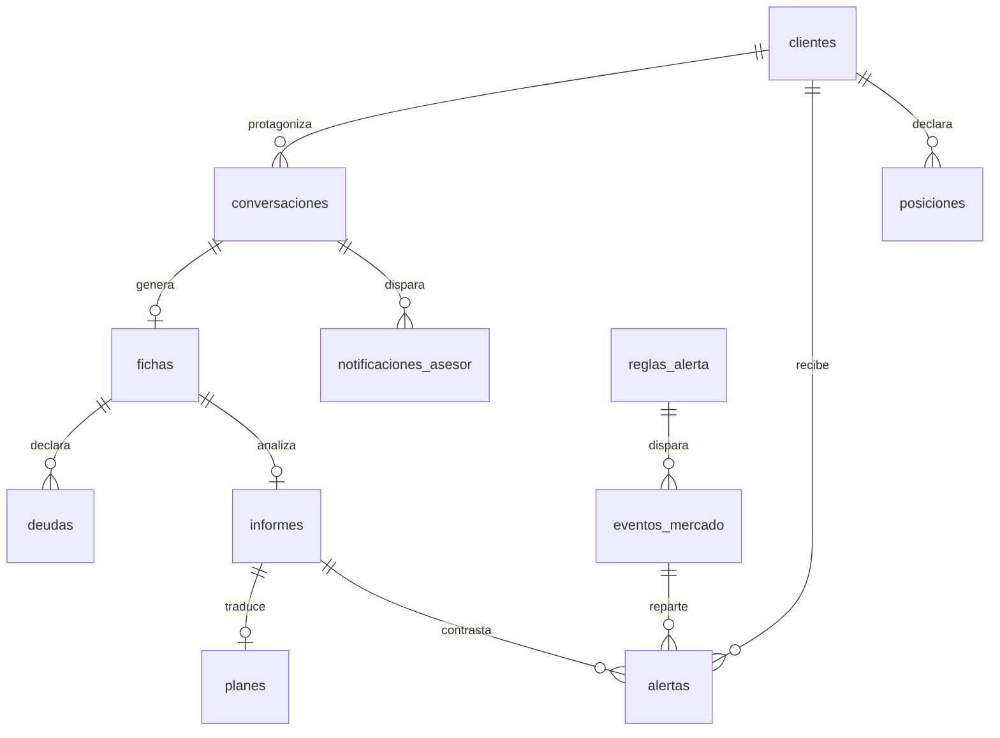

# Modelo de datos

<!-- Actualizar este archivo cada vez que se añada, modifique o elimine una tabla o relación.
     El agente de codificación debe consultar este archivo antes de hacer cualquier migración. -->

**Nota de traducción:** `instrucciones-sistema.md` e `instrucciones-motor.md` definen su contrato de
datos con líneas `clave: valor [estado]` — el mismo formato que usaba la versión de escritorio
(`ficha-[nombre].md`, `informe-[nombre].md`), pero desde el 2026-08-24 su destino es Supabase, no
archivos locales. Este documento traslada ese contrato a tablas de Postgres —incluida la etiqueta
`[confirmado|estimado|pendiente]` de cada dato, que aquí es una columna `_estado` paralela a cada
campo en vez de una anotación en la misma línea.

---

## Entidades principales

### auth.users (gestionada por Supabase Auth)
Tabla nativa de Supabase. Login por magic link (ver `architecture.md` → "Estrategia de
autenticación"). Estar en `asesores` (más abajo) es lo que da acceso al panel — tener una fila en
`auth.users` por sí solo no basta.

### Tipo `dato_estado` (enum reutilizado)
`'confirmado' | 'estimado' | 'pendiente'` — reproduce la etiqueta que ya usa
`instrucciones-sistema.md` para cada dato de la ficha.

### Enums de la capa de vigilancia de mercado (migración 0002)
- `clase_activo` — `'liquidez' | 'renta_fija' | 'renta_variable' | 'oro'`
- `direccion_movimiento` — `'caida' | 'subida'`
- `estado_alerta` — `'nueva' | 'vista' | 'descartada'`
- `banda_probabilidad` — `'alta' | 'razonable' | 'fragil' | 'baja'` — mismos valores que el `check`
  inline de `informes.mc_banda`, pero como enum reutilizable; `mc_banda` no se toca y conviven.

### asesores
Lista blanca de quién puede ver el panel (`S-01`). Estar en esta tabla **es** el permiso — no basta
con tener una cuenta de Supabase Auth válida.

| Campo | Tipo | Descripción |
|-------|------|-------------|
| id | uuid, PK, FK → auth.users | — |
| nombre | text | — |
| creado_en | timestamptz | — |

### clientes
El visitante se convierte en cliente cuando da su nombre y su email dentro del chat — no antes. Una
conversación abandonada antes de ese punto no deja ningún dato personal (minimización de datos,
RGPD). Si alguien repite entrevista con el mismo email, se enlaza al mismo cliente en vez de
duplicar el lead (email normalizado a minúsculas antes de insertar).

| Campo | Tipo | Descripción |
|-------|------|-------------|
| id | uuid, PK | — |
| nombre | text | — |
| email | text, único | — |
| creado_en | timestamptz | — |
| avisar_cliente | boolean, **not null**, default `false` | Añadida en 0002. Si es `true`, la revisión diaria (`scripts/revision.ts`) le manda un correo al cliente por cada alerta nueva que le afecte; si es `false`, la alerta se registra pero no se le escribe |

### conversaciones
Una fila por cada visitante que abre el chat, exista o no llegue a completarlo.

| Campo | Tipo | Descripción |
|-------|------|-------------|
| id | uuid, PK | Identificador de la conversación |
| cliente_id | uuid, FK → clientes, nullable | Null hasta que el visitante da nombre y email |
| token | uuid, único | Secreto en la URL de la sesión activa; es lo único que autoriza al backend a escribir en esta conversación concreta. Se genera al aceptar el consentimiento — no es una URL personalizada por destinatario (eso sigue descartado, ver `docs/prd.md`), es un identificador de sesión efímero |
| consentimiento_en | timestamptz, **not null** | La conversación no existe sin consentimiento previo de tratamiento de datos — se crea la fila en el momento de aceptar |
| expira_en | timestamptz | Por defecto, `iniciada_en` + 30 días |
| iniciada_en | timestamptz | Momento en que el visitante abrió el chat |
| finalizada_en | timestamptz, nullable | Momento en que se cerró (completada o abandonada) |
| estado | text — `'en_curso' \| 'completada' \| 'abandonada'` | Estado de la conversación |
| turnos_totales | int | Número de intercambios pregunta-respuesta, para vigilar el tope de ~15 |

### limites_uso
Control de abuso: la entrevista es pública y cada mensaje cuesta dinero en la API de Claude. Sin
límite, recargar la página en bucle vacía el saldo. Se guarda un **hash** de la IP, nunca la IP en
claro — sigue sirviendo para contar sin ser un dato personal identificable.

| Campo | Tipo | Descripción |
|-------|------|-------------|
| id | bigint, PK | — |
| ip_hash | text | Hash de la IP de origen, no la IP |
| accion | text — `'crear_conversacion' \| 'enviar_mensaje'` | — |
| creado_en | timestamptz | — |

### fichas
Una fila por conversación completada — equivalente a la ficha que cierra las Fases 1-2 de
`instrucciones-sistema.md`. Contiene exactamente las claves fijas de ese contrato, salvo las deudas
(tabla `deudas` aparte, por ser un grupo repetible) y el email (vive en `clientes`, no se duplica
aquí).

| Campo | Tipo | Descripción |
|-------|------|-------------|
| id | uuid, PK | Identificador de la ficha |
| conversacion_id | uuid, FK → conversaciones, único | Conversación de la que procede |
| nombre | text, nullable | Nombre dado por el visitante (bloque 0) |
| nombre_estado | dato_estado | — |
| fecha_entrevista | date | Fecha de la entrevista |
| ingresos_netos_mensual | numeric, nullable | — |
| ingresos_netos_mensual_estado | dato_estado | — |
| ingresos_estabilidad | text — `'estable' \| 'variable'`, nullable | — |
| ingresos_estabilidad_estado | dato_estado | — |
| gastos_fijos_mensual | numeric, nullable | — |
| gastos_fijos_mensual_estado | dato_estado | — |
| deudas_interes_alto_declarado | text — `'si' \| 'no' \| 'no_facilitado'`, nullable | Fallback binario cuando el cliente se niega a dar el detalle completo de sus deudas (regla de `plantilla-entrevista.md` bloque 3) — no sustituye a las filas de `deudas`, solo da una señal de prioridad cuando esas filas quedan pendientes |
| deudas_interes_alto_declarado_estado | dato_estado | — |
| patrimonio_liquido | numeric, nullable | — |
| patrimonio_liquido_estado | dato_estado | — |
| patrimonio_invertido | numeric, nullable | — |
| patrimonio_invertido_estado | dato_estado | — |
| patrimonio_distribucion | text, nullable | Reparto aproximado por clase de activo, en prosa; "no aplica" si `patrimonio_invertido` = 0 (regla de `plantilla-entrevista.md` bloque 4) |
| patrimonio_distribucion_estado | dato_estado | — |
| aportacion_mensual_actual | numeric, nullable | 0 si el cliente no aporta nada, no "pendiente" (regla de `plantilla-entrevista.md` bloque 4) |
| aportacion_mensual_actual_estado | dato_estado | — |
| colchon_meses | numeric, nullable | — |
| colchon_meses_estado | dato_estado | — |
| objetivo_proposito | text, nullable | — |
| objetivo_proposito_estado | dato_estado | — |
| objetivo_importe | numeric, nullable | — |
| objetivo_importe_estado | dato_estado | — |
| objetivo_plazo_anios | numeric, nullable | — |
| objetivo_plazo_anios_estado | dato_estado | — |
| riesgo_tolerancia_declarada | text — `'baja' \| 'media' \| 'alta'`, nullable | — |
| riesgo_tolerancia_declarada_estado | dato_estado | — |
| riesgo_comportamiento_real | text, nullable | "sin dato" si nunca vivió una caída real (regla de `plantilla-entrevista.md` bloque 7) |
| riesgo_comportamiento_real_estado | dato_estado | — |
| riesgo_perfil_derivado | text — `'conservador' \| 'moderado' \| 'dinamico'`, nullable | Clasificado por la Fase 2 (agente), no por `lib/motor/`: interpretar texto libre no es un cálculo determinista (regla de `plantilla-entrevista.md` bloque 7, R3/C6 de `reglas-recomendacion.md`) |
| riesgo_perfil_derivado_estado | dato_estado | — |
| edad | int, nullable | — |
| edad_estado | dato_estado | — |
| personas_a_cargo | int, nullable | — |
| personas_a_cargo_estado | dato_estado | — |
| situacion_laboral | text, nullable | — |
| situacion_laboral_estado | dato_estado | — |
| created_at | timestamptz | — |

### deudas
Grupo repetible de la ficha (0 a N filas por ficha) — equivalente a los cuartetos
`deuda_N_tipo/importe/cuota/interes` del contrato de `instrucciones-sistema.md`.

| Campo | Tipo | Descripción |
|-------|------|-------------|
| id | uuid, PK | — |
| ficha_id | uuid, FK → fichas | — |
| orden | int | Orden de declaración (1, 2, 3…) |
| tipo | text, nullable | — |
| tipo_estado | dato_estado | — |
| importe | numeric, nullable | — |
| importe_estado | dato_estado | — |
| cuota | numeric, nullable | — |
| cuota_estado | dato_estado | — |
| interes | numeric, nullable | TAE en % — decide si es "deuda cara" (R1, umbral 7-8%). `pendiente` si el cliente no supo ni el tipo de deuda para estimarlo (C8) |
| interes_estado | dato_estado | — |

`deudas_numero = 0` (caso borde C9 de `instrucciones-motor.md`) se representa como ausencia de
filas, no como una fila especial.

### informes
Una fila por diagnóstico generado por el motor (Fases 3-4 de `instrucciones-motor.md`) — el
informe técnico interno de §7.
Relación 1:1 con `fichas` en esta versión (no hay reprocesado manual; si se reejecuta el motor sobre
la misma ficha, se versiona con una fila nueva en vez de sobrescribir, igual que el archivo
`informe-[nombre]-AAAA-MM-DD.md` del diseño original).

| Campo | Tipo | Descripción |
|-------|------|-------------|
| id | uuid, PK | — |
| ficha_id | uuid, FK → fichas | — |
| modo | text — `'completo' \| 'condicionado' \| 'suspendido'` | Modo según calidad del dato (`instrucciones-motor.md` §4) |
| tipo_meta | text — `'patrimonio' \| 'renta_cartera' \| 'renta_negocio' \| 'mixta_ambigua'` | Clasificación de la meta (§3) |
| flujo_libre | numeric, nullable | Ingresos − gastos − cuotas de deuda |
| porcentaje_camino_recorrido | numeric, nullable | Solo si la meta es convertible a patrimonio |
| proyeccion_valor_futuro | numeric, nullable | A ritmo actual, supuestos explícitos en `contenido` |
| gap_euros | numeric, nullable | — |
| gap_anios | numeric, nullable | — |
| aportacion_propuesta | numeric, nullable | Solo en modo `completo` |
| cartera_objetivo | jsonb, nullable | `{ renta_variable, renta_fija, liquidez, oro, cripto }` en % |
| rentabilidad_esperada_neta | numeric, nullable | Ponderada por composición, neta de costes (R5) |
| mc_percentil_pesimista | numeric, nullable | Percentil p10 del Monte Carlo (R10), euros actuales — solo si aplica (meta convertible a patrimonio, modo `completo`) |
| mc_percentil_central | numeric, nullable | Percentil p50 |
| mc_percentil_optimista | numeric, nullable | Percentil p90 |
| mc_probabilidad_cumplimiento | numeric, nullable | Fracción 0–1 — soporta `M-07` |
| mc_banda | text — `'alta' \| 'razonable' \| 'fragil' \| 'baja'`, nullable | Banda de R10 derivada de `mc_probabilidad_cumplimiento` |
| probabilidad | numeric, nullable | Añadida en 0002. Probabilidad de cumplimiento del plan a efectos de la capa de alertas — separada de `mc_probabilidad_cumplimiento` (Monte Carlo), que no se toca |
| banda | `banda_probabilidad`, nullable | Añadida en 0002. Banda cualitativa asociada a `probabilidad`; enum, no `text`+`check` como `mc_banda` |
| contenido | jsonb | Estructura completa del informe (Partes A/B/C de `instrucciones-motor.md` §7: diagnóstico, propuesta preliminar, trazabilidad y pendientes) — uso interno, nunca se muestra tal cual al visitante |
| pendientes_reunion | jsonb | Array de strings — casos borde o datos pendientes que quedan para que el asesor los trate en la reunión |
| version_motor | text | Versión de `lib/motor/` usada para este cálculo |
| version_reglas | text | Versión de `docs/criterio/reglas-recomendacion.md` usada — sin esto, un informe antiguo es imposible de reproducir si las reglas cambian |
| created_at | timestamptz | — |

Todo campo numérico de esta tabla lo escribe `lib/motor/` (código determinista), nunca el modelo de
lenguaje directamente — ver la decisión técnica correspondiente en `architecture.md`.

### planes
Lo que de verdad ve el visitante en el chat (`M-03` del PRD) — separado de `informes` a propósito:
`informes` es el registro técnico interno, `planes` es su traducción a lenguaje llano ya entregada.
Guardar el contenido exacto tal cual se mostró (incluido el descargo) es lo que permite auditar
después qué vio cada cliente y cuándo, sin depender de reconstruirlo a partir de las reglas vigentes
hoy.

| Campo | Tipo | Descripción |
|-------|------|-------------|
| id | uuid, PK | — |
| informe_id | uuid, FK → informes | — |
| secciones | jsonb | El plan en llano, estructurado por secciones |
| markdown | text | El mismo contenido en markdown, tal cual se renderiza en el chat |
| descargo | text | El texto exacto del disclaimer mostrado con este plan — se guarda con el plan, no solo con la plantilla, para que quede constancia de qué se le dijo al cliente |
| generado_en | timestamptz | — |

### notificaciones_asesor
Registro del aviso automático (`M-05` del PRD), para poder confirmar que se envió y depurar fallos.

| Campo | Tipo | Descripción |
|-------|------|-------------|
| id | uuid, PK | — |
| conversacion_id | uuid, FK → conversaciones | — |
| destinatario | text | Email del asesor |
| enviado_en | timestamptz, nullable | Null si el envío falló |
| estado | text — `'enviado' \| 'fallido'` | — |

---

## Capa de vigilancia de mercado (migración 0002)

Capa montada **encima** del esquema inicial, sin tocar ninguna tabla previa. La lógica de decisión
vive en `src/lib/alertas/` (funciones puras) y el proceso diario que la conecta con el mundo real
en `scripts/revision.ts`. El diseño de estas cinco tablas gira alrededor de tres `UNIQUE` que hacen
**idempotente** todo el pipeline: reejecutar la revisión no duplica observaciones, ni eventos, ni
alertas, ni reenvía correos.

### observaciones_mercado
Serie temporal cruda: un nivel por clase de activo y fecha. La ingesta (hoy: cierres del S&P 500 vía
la API pública de Yahoo Finance) es idempotente por el `UNIQUE (clase, fecha)` — reingestar la misma
fuente no duplica la serie.

| Campo | Tipo | Descripción |
|-------|------|-------------|
| id | uuid, PK | — |
| clase | `clase_activo` | — |
| fecha | date | ISO `AAAA-MM-DD` |
| nivel | numeric | Nivel/cierre del índice en esa fecha |
| fuente | text | Origen del dato, p. ej. `yahoo-finance:SPY` |
| creado_en | timestamptz | — |
| — | **UNIQUE (clase, fecha)** | Una sola lectura por clase de activo y día |

### reglas_alerta
Catálogo de condiciones que se vigilan. `perfil` NULL = la regla aplica a todos los perfiles.

| Campo | Tipo | Descripción |
|-------|------|-------------|
| id | uuid, PK | — |
| nombre | text | — |
| clase | `clase_activo` | — |
| direccion | `direccion_movimiento` | — |
| umbral | numeric | En **tanto por uno**: `0.03` = 3 % |
| ventana_dias | int | Nº de días de la ventana que se compara |
| perfil | text — `'conservador' \| 'moderado' \| 'dinamico'`, nullable | `check (perfil is null or perfil in (...))`. NULL = aplica a todos |
| activa | boolean, default `true` | Solo las activas se evalúan |
| creado_en | timestamptz | — |

### eventos_mercado
Cada vez que una regla se cumple sobre la serie se registra un evento. El `UNIQUE (regla_id, hasta)`
hace idempotente la detección: recalcular la misma ventana (mismo día de cierre) no crea eventos
repetidos para esa regla.

| Campo | Tipo | Descripción |
|-------|------|-------------|
| id | uuid, PK | — |
| regla_id | uuid, FK → reglas_alerta | — |
| clase | `clase_activo` | Denormalizada de la regla, para consulta directa |
| variacion | numeric | Variación observada en la ventana, en tanto por uno **con signo** (negativa = caída) |
| desde | date | Observación del inicio de la ventana comparada |
| hasta | date | Última observación de la serie |
| creado_en | timestamptz | — |
| — | **UNIQUE (regla_id, hasta)** | Un evento por regla y fecha de cierre de ventana |

### alertas
Reparto de un evento a los clientes afectados. El `UNIQUE (evento_id, cliente_id)` garantiza una
alerta como máximo por cliente y evento: el reparto puede re-ejecutarse sin duplicar avisos, y el
correo al cliente se manda **solo** por las filas recién insertadas.

| Campo | Tipo | Descripción |
|-------|------|-------------|
| id | uuid, PK | — |
| evento_id | uuid, FK → eventos_mercado | — |
| cliente_id | uuid, FK → clientes | — |
| analisis_id | uuid, FK → informes, nullable | Informe contra el que se contrasta el movimiento, si lo hay |
| estado | `estado_alerta`, default `'nueva'` | — |
| mensaje | text, nullable | Frase descriptiva generada por `src/lib/alertas/redactar.ts` |
| avisado_cliente_en | timestamptz, nullable | Se rellena al enviar el correo al cliente; null si no se envió |
| creado_en | timestamptz | — |
| — | **UNIQUE (evento_id, cliente_id)** | Una alerta por cliente y evento |

Índices: `alertas_cliente_id_idx (cliente_id)`, `alertas_analisis_id_idx (analisis_id)`.

### posiciones
Cartera declarada de cada cliente, para saber a quién afecta un evento de mercado.

| Campo | Tipo | Descripción |
|-------|------|-------------|
| id | uuid, PK | — |
| cliente_id | uuid, FK → clientes | — |
| clase | `clase_activo` | — |
| activo | text | Nombre del activo |
| ticker | text, nullable | — |
| importe | numeric | Importe invertido en esa posición |
| creado_en | timestamptz | — |

Índice: `posiciones_cliente_id_idx (cliente_id)`.

---

## Relaciones entre entidades

`observaciones_mercado` no tiene FK: es una serie temporal cruda que `scripts/revision.ts` cruza con
`reglas_alerta` en código, no por relación.

---

## Políticas de acceso (RLS)

Ningún visitante habla con Supabase directamente: todas las escrituras (crear conversación,
guardar ficha, guardar informe, guardar plan) pasan por `app/api/chat/` en el servidor, usando la
clave de servicio (`SUPABASE_SERVICE_ROLE_KEY`), que no pasa por RLS y valida el `token` de la
conversación en código, no en la base de datos. La clave pública (`anon`) que llega al navegador no
necesita ningún permiso sobre estas tablas.

RLS **activado** en las catorce tablas — las nueve de 001 (`asesores`, `clientes`, `conversaciones`,
`fichas`, `deudas`, `informes`, `planes`, `notificaciones_asesor`, `limites_uso`) y las cinco de
0002 (`observaciones_mercado`, `reglas_alerta`, `eventos_mercado`, `alertas`, `posiciones`) — sin
ninguna policy para el rol `anon` — deniega por defecto.

- **SELECT:** permitido para el rol `authenticated`, condicionado a que exista una fila propia en
  `asesores` (función `es_asesor()`, `security definer`) — no basta con estar autenticado, hay que
  estar en la lista blanca. Necesario para el panel `S-01`. Las cinco tablas de 0002 llevan la misma
  policy `..._select` con `es_asesor()`.
- **INSERT / UPDATE / DELETE:** ninguna policy para `authenticated` ni `anon`. Todas las escrituras
  vienen del backend con la clave de servicio — `app/api/chat/` para el flujo del chat,
  `scripts/revision.ts` para la revisión diaria de mercado.

---

## Migraciones

Ambas migraciones están **aplicadas contra el proyecto Supabase real** (001 el 2026-08-27, 0002 el
2026-08-31).

| Fecha | Archivo | Descripción |
|-------|---------|-------------|
| 2026-08-25 (escrita), 2026-08-27 (aplicada) | `supabase/migrations/001_esquema_inicial.sql` | Crea el enum `dato_estado` y las tablas `asesores`, `clientes`, `conversaciones`, `limites_uso`, `fichas`, `deudas`, `informes`, `planes`, `notificaciones_asesor`, con sus RLS y la función `es_asesor()` |
| 2026-08-31 (escrita y aplicada) | `supabase/migrations/0002_alertas_de_mercado.sql` | Capa de vigilancia de mercado. Enums `clase_activo`, `direccion_movimiento`, `estado_alerta`, `banda_probabilidad`; columnas `clientes.avisar_cliente`, `informes.probabilidad`, `informes.banda`; tablas `observaciones_mercado`, `reglas_alerta`, `eventos_mercado`, `alertas`, `posiciones` con sus tres `UNIQUE` de idempotencia, RLS (SELECT `es_asesor()`) y tres reglas sembradas |

**Verificación local:** ejecutada contra Postgres real vía PGlite (WASM), con roles
`authenticated`/`anon`/`service_role` y un `auth.users`/`auth.uid()` mínimos simulados (Supabase los
provee de forma nativa). Se comprobó: la migración aplica sin errores; RLS queda activado en las 9
tablas; inserción de una fila completa por toda la cadena de FKs (`clientes` → `conversaciones` →
`fichas` → `deudas` → `informes` → `planes`); los `check` de dominio (p. ej.
`ingresos_estabilidad`) rechazan valores fuera de lista; `conversaciones.consentimiento_en not null`
impide crear una conversación sin consentimiento (`M-06`).

**001 aplicada contra Supabase real (2026-08-27):** el usuario la ejecutó desde el SQL Editor del
panel, con las credenciales reales ya puestas en `.env.local`. El proyecto tenía un esquema previo
completamente distinto (`entrevistas`/`analisis`/`mensajes`, de una versión anterior del diseño) —
confirmado vacío y sustituido por este, tras limpiarlo. Verificado después en vivo: las 9 tablas y
sus columnas exactas existen (vía el esquema OpenAPI de PostgREST), y un ciclo completo de escritura
(conversación → token → cierre con cliente/ficha/deudas/informe/plan) funciona igual que contra
PGlite (ver `docs/features/consentimiento-y-persistencia.md`, Verificada).

**0002 aplicada contra Supabase real (2026-08-31)** vía el MCP de Supabase (`apply_migration`, que la
registra en el historial: `20260831093650_alertas_de_mercado`). Verificado después: las 5 tablas
existen con sus columnas y enums, los 3 `UNIQUE` de idempotencia están, RLS activado en las cinco con
policy SELECT `es_asesor()` y ninguna para `anon`, `clientes.avisar_cliente` / `informes.probabilidad`
/ `informes.banda` presentes, y las 3 reglas sembradas (umbral 0.03/0.04/0.06, ventana 5 días,
perfiles conservador/moderado/dinamico).

---

## Datos seed

**Migración 001:** ninguno. No hay catálogos, roles ni configuración inicial que precargar; el único
usuario (el asesor) se crea directamente en Supabase Auth.

**Migración 0002:** tres filas en `reglas_alerta` — caída de renta variable a 5 días, un umbral por
perfil:

| nombre | clase | direccion | umbral | ventana_dias | perfil |
|--------|-------|-----------|--------|--------------|--------|
| Caída renta variable 5d — conservador | renta_variable | caida | 0.03 | 5 | conservador |
| Caída renta variable 5d — moderado | renta_variable | caida | 0.04 | 5 | moderado |
| Caída renta variable 5d — dinamico | renta_variable | caida | 0.06 | 5 | dinamico |
