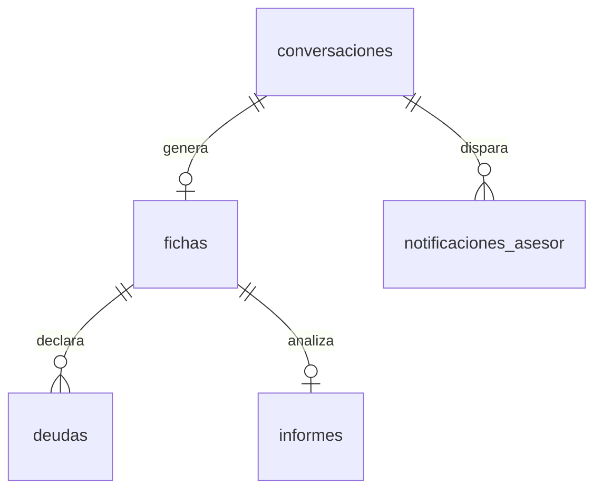

# Modelo de datos

<!-- Actualizar este archivo cada vez que se añada, modifique o elimine una tabla o relación.
     El agente de codificación debe consultar este archivo antes de hacer cualquier migración. -->

**Nota de traducción:** `instrucciones-sistema.md` e `instrucciones-motor.md` definen su contrato de
datos como archivos markdown (`ficha-[nombre].md`, `informe-[nombre].md`) con líneas
`clave: valor [estado]`. Este documento traslada ese mismo contrato a tablas de Postgres —incluida
la etiqueta `[confirmado|estimado|pendiente]` de cada dato, que aquí es una columna `_estado`
paralela a cada campo en vez de una anotación en la misma línea. Cuando se reescriban esos dos
documentos (ver decisión técnica en `architecture.md`), deben apuntar a este esquema, no a archivos
locales.

---

## Entidades principales

### auth.users (gestionada por Supabase Auth)
Tabla nativa de Supabase. Un único usuario: el asesor. No se modifica directamente; el login es por
magic link (ver `architecture.md` → "Estrategia de autenticación").

### Tipo `dato_estado` (enum reutilizado)
`'confirmado' | 'estimado' | 'pendiente'` — reproduce la etiqueta que ya usa
`instrucciones-sistema.md` para cada dato de la ficha.

### conversaciones
Una fila por cada visitante que abre el chat, exista o no llegue a completarlo.

| Campo | Tipo | Descripción |
|-------|------|-------------|
| id | uuid, PK | Identificador de la conversación |
| iniciada_en | timestamptz | Momento en que el visitante abrió el chat |
| finalizada_en | timestamptz, nullable | Momento en que se cerró (completada o abandonada) |
| estado | text — `'en_curso' \| 'completada' \| 'abandonada'` | Estado de la conversación |
| turnos_totales | int | Número de intercambios pregunta-respuesta, para vigilar el tope de ~12 |

### fichas
Una fila por conversación completada — equivalente a `ficha-[nombre].md` del Módulo 1. Contiene
exactamente las claves fijas del contrato de `instrucciones-sistema.md`, salvo las deudas (tabla
`deudas` aparte, por ser un grupo repetible).

| Campo | Tipo | Descripción |
|-------|------|-------------|
| id | uuid, PK | Identificador de la ficha |
| conversacion_id | uuid, FK → conversaciones, único | Conversación de la que procede |
| cliente | text | Nombre dado por el visitante |
| fecha_entrevista | date | Fecha de la entrevista |
| ingresos_netos_mensual | numeric, nullable | — |
| ingresos_netos_mensual_estado | dato_estado | — |
| gastos_fijos_mensual | numeric, nullable | — |
| gastos_fijos_mensual_estado | dato_estado | — |
| patrimonio_liquido | numeric, nullable | — |
| patrimonio_liquido_estado | dato_estado | — |
| patrimonio_invertido | numeric, nullable | — |
| patrimonio_invertido_estado | dato_estado | — |
| aportacion_mensual_actual | numeric, nullable | 0 si el cliente no aporta nada, no "pendiente" (regla de `plantilla-entrevista.md` bloque 4) |
| aportacion_mensual_actual_estado | dato_estado | — |
| colchon_meses | numeric, nullable | — |
| colchon_meses_estado | dato_estado | — |
| objetivo_proposito | text, nullable | — |
| objetivo_proposito_estado | dato_estado | — |
| objetivo_importe | numeric, nullable | — |
| objetivo_importe_estado | dato_estado | — |
| objetivo_plazo_anios | numeric, nullable | — |
| objetivo_plazo_anios_estado | dato_estado | — |
| riesgo_tolerancia_declarada | text — `'baja' \| 'media' \| 'alta'`, nullable | — |
| riesgo_tolerancia_declarada_estado | dato_estado | — |
| riesgo_comportamiento_real | text, nullable | "sin dato" si nunca vivió una caída real (regla de `plantilla-entrevista.md` bloque 7) |
| riesgo_comportamiento_real_estado | dato_estado | — |
| edad | int, nullable | — |
| edad_estado | dato_estado | — |
| personas_a_cargo | int, nullable | — |
| personas_a_cargo_estado | dato_estado | — |
| situacion_laboral | text, nullable | — |
| situacion_laboral_estado | dato_estado | — |
| created_at | timestamptz | — |

`patrimonio_distribucion` (composición por clase de activo de lo ya invertido) queda **fuera** del
esquema a propósito: `instrucciones-motor.md` §2 señala que la entrevista actual no la recoge, y que
mientras no se añada, la transición del patrimonio queda siempre "pendiente". No se inventa una
columna para un dato que la entrevista no pregunta todavía.

### deudas
Grupo repetible de la ficha (0 a N filas por ficha) — equivalente a las tripletas
`deuda_N_tipo/importe/cuota` del Módulo 1.

| Campo | Tipo | Descripción |
|-------|------|-------------|
| id | uuid, PK | — |
| ficha_id | uuid, FK → fichas | — |
| orden | int | Orden de declaración (1, 2, 3…) |
| tipo | text, nullable | — |
| tipo_estado | dato_estado | — |
| importe | numeric, nullable | — |
| importe_estado | dato_estado | — |
| cuota | numeric, nullable | — |
| cuota_estado | dato_estado | — |

`deudas_numero = 0` (caso borde C9 de `instrucciones-motor.md`) se representa como ausencia de
filas, no como una fila especial.

### informes
Una fila por diagnóstico generado por el motor (Módulo 2) — equivalente a `informe-[nombre].md`.
Relación 1:1 con `fichas` en esta versión (no hay reprocesado manual; si se reejecuta el motor sobre
la misma ficha, se versiona con una fila nueva en vez de sobrescribir, igual que el archivo
`informe-[nombre]-AAAA-MM-DD.md` del diseño original).

| Campo | Tipo | Descripción |
|-------|------|-------------|
| id | uuid, PK | — |
| ficha_id | uuid, FK → fichas | — |
| modo | text — `'completo' \| 'condicionado' \| 'suspendido'` | Modo según calidad del dato (`instrucciones-motor.md` §4) |
| tipo_meta | text — `'patrimonio' \| 'renta_cartera' \| 'renta_negocio' \| 'mixta_ambigua'` | Clasificación de la meta (§3) |
| flujo_libre | numeric, nullable | Ingresos − gastos − cuotas de deuda |
| porcentaje_camino_recorrido | numeric, nullable | Solo si la meta es convertible a patrimonio |
| proyeccion_valor_futuro | numeric, nullable | A ritmo actual, supuestos explícitos en `contenido` |
| gap_euros | numeric, nullable | — |
| gap_anios | numeric, nullable | — |
| aportacion_propuesta | numeric, nullable | Solo en modo `completo` |
| cartera_objetivo | jsonb, nullable | `{ renta_variable, renta_fija, liquidez, oro, cripto }` en % |
| rentabilidad_esperada_neta | numeric, nullable | Ponderada por composición, neta de costes (R5) |
| contenido | jsonb | Estructura completa del informe (Partes A/B/C de `instrucciones-motor.md` §7: diagnóstico, propuesta preliminar, trazabilidad y pendientes) — es lo que redacta `DiagnosisCard` |
| pendientes_reunion | jsonb | Array de strings — casos borde o datos pendientes que quedan para que el asesor los trate en la reunión |
| created_at | timestamptz | — |

Todo campo numérico de esta tabla lo escribe `lib/motor/` (código determinista), nunca el modelo de
lenguaje directamente — ver la decisión técnica correspondiente en `architecture.md`.

### notificaciones_asesor
Registro del aviso automático (`M-05` del PRD), para poder confirmar que se envió y depurar fallos.

| Campo | Tipo | Descripción |
|-------|------|-------------|
| id | uuid, PK | — |
| conversacion_id | uuid, FK → conversaciones | — |
| destinatario | text | Email del asesor |
| enviado_en | timestamptz, nullable | Null si el envío falló |
| estado | text — `'enviado' \| 'fallido'` | — |

---

## Relaciones entre entidades

---

## Políticas de acceso (RLS)

Ningún visitante habla con Supabase directamente: todas las escrituras (crear conversación,
guardar ficha, guardar informe) pasan por `app/api/chat/` en el servidor, usando la clave de
servicio (`SUPABASE_SERVICE_ROLE_KEY`), que no pasa por RLS. La clave pública (`anon`) que llega al
navegador no necesita ningún permiso sobre estas tablas.

RLS **activado** en las cinco tablas (`conversaciones`, `fichas`, `deudas`, `informes`,
`notificaciones_asesor`), sin ninguna policy para el rol `anon` — deniega por defecto. Única policy
por tabla:

- **SELECT:** permitido para el rol `authenticated` (en la práctica, solo el asesor: es el único
  usuario que puede autenticarse, ver `architecture.md`). Necesario para el panel `S-01`.
- **INSERT / UPDATE / DELETE:** ninguna policy para `authenticated` ni `anon`. Todas las escrituras
  vienen del backend con la clave de servicio.

---

## Migraciones

Ninguna aplicada todavía — el proyecto está en fase de documentación, no de implementación. Primera
migración planeada:

| Fecha | Archivo | Descripción |
|-------|---------|-------------|
| _pendiente_ | `001_esquema_inicial.sql` | Crea el enum `dato_estado` y las tablas `conversaciones`, `fichas`, `deudas`, `informes`, `notificaciones_asesor` con sus RLS |

El servidor MCP de Supabase está registrado en modo `read_only=true` (ver `architecture.md` →
"MCPs del proyecto"): no puede aplicar esta migración tal cual está configurado. Habrá que quitar
esa restricción cuando se implemente, o aplicar la migración desde el CLI/dashboard de Supabase.

---

## Datos seed

Ninguno necesario: no hay catálogos, roles ni configuración inicial que precargar. El único usuario
(el asesor) se crea directamente en Supabase Auth, no por seed.
