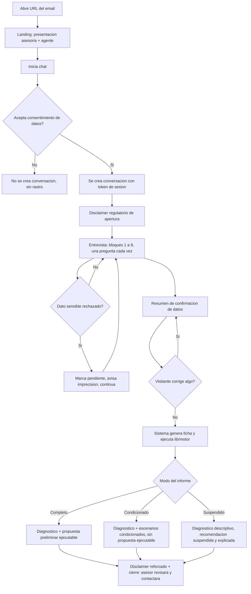
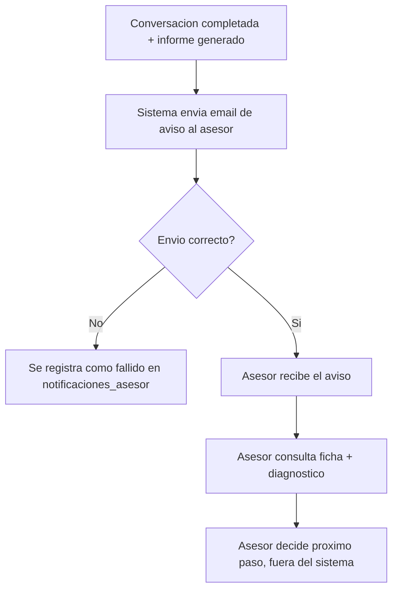

# Flujos de usuario

<!-- Documentación detallada de los flujos de usuario principales.
     El PRD los describe narrativamente; este archivo entra en detalle con diagramas y estados.
     Actualizar cuando cambie un flujo existente o se añada uno nuevo. -->

---

## Convenciones de este documento

<!-- Los flujos se documentan con:
     1. Descripción narrativa (qué hace el usuario, qué ve)
     2. Diagrama de flujo en Mermaid (estados y transiciones)
     3. Estados de error y casos edge
     
     Cada flujo tiene un ID para poder referenciarlo desde el PRD o desde el código. -->

---

## [FLOW-01] — Entrevista y diagnóstico financiero inicial

**Actor:** Visitante (cliente potencial)
**Trigger:** Abre la URL de la landing recibida por email
**Resultado esperado:** Ha completado la entrevista de 8 bloques, ha confirmado sus datos, y ha
recibido en el propio chat su diagnóstico y una propuesta preliminar (o los escenarios
condicionados / el modo de estabilización que corresponda), con el disclaimer regulatorio.

### Pasos

1. El visitante abre la landing desde la URL del email.
2. Ve la presentación de la asesoría y del agente, y pulsa el punto de entrada para iniciar el
   chat.
3. Acepta el consentimiento de tratamiento de datos (`M-06`). Hasta este punto no existe ninguna
   fila de conversación ni se ha guardado ningún dato personal. Solo al aceptar, el servidor crea
   la conversación con su `token` de sesión y el timestamp de consentimiento.
4. El agente se presenta y da el disclaimer regulatorio de apertura (obligatorio, no se salta —
   distinto del consentimiento del paso anterior: uno autoriza el tratamiento de datos, el otro
   aclara que no es asesoramiento regulado).
5. El agente conduce la entrevista en el orden fijo de `plantilla-entrevista.md` — ingresos,
   gastos, deudas, ahorro/inversión, colchón, objetivo, horizonte/riesgo, edad/situación vital —
   una pregunta cada vez, con repregunta única cuando la respuesta es ambigua y opción de saltar
   datos sensibles.
6. Al terminar los 8 bloques, el agente repasa un resumen de confirmación de los datos dados (sin
   cálculos ni veredictos).
7. El visitante confirma o corrige.
8. Con la confirmación, el sistema genera la ficha, la persiste, y ejecuta `lib/motor/` sobre ella.
9. El agente muestra en el chat, en una card diferenciada (`DiagnosisCard`), el resultado según el
   modo que le corresponda (completo / condicionado / suspendido — `instrucciones-motor.md` §4),
   junto al disclaimer reforzado de que un asesor humano lo revisará. El plan mostrado se guarda
   íntegro (`planes`), con el disclaimer exacto que se le presentó.
10. El chat cierra indicando que el asesor revisará el caso y se pondrá en contacto.

### Diagrama

### Casos de error

- **No acepta el consentimiento:** no se crea conversación, no se persiste ningún dato. El
  visitante puede volver a intentarlo desde la landing en cualquier momento.
- **Límite de uso excedido (`docs/architecture.md` → "Protección contra abuso"):** el servidor
  rechaza crear una conversación nueva o procesar un mensaje; se informa al visitante con un
  mensaje genérico, sin detalle técnico del límite.
- **Abandono a mitad de la entrevista:** la conversación queda en estado `abandonada` (o
  `en_curso` hasta un umbral de inactividad); no se genera ficha ni informe, no se dispara el aviso
  al asesor (`FLOW-02`).
- **Fallo de Claude API o de Supabase durante un turno:** mensaje de error genérico al visitante,
  invitando a recargar o volver a intentarlo. No se inventan respuestas ni se avanza la entrevista
  sin confirmación real del visitante.
- **Ficha con claves ausentes o formato roto al llegar a `lib/motor/`** (caso borde C16 de
  `instrucciones-motor.md`): no se adivina el dato — se trata como pendiente, se reporta la
  anomalía, y el chat lo comunica con transparencia al visitante en vez de fallar en silencio o
  mostrar una cifra inventada.
- **El visitante vuelve a abrir la misma URL genérica más tarde:** en esta versión no hay forma de
  recuperar una conversación anterior (no hay cuentas ni URLs personalizadas — ver `WON'T` del
  PRD); empieza una entrevista nueva. Recuperar el historial es `C-01`, fuera del MVP.

---

## [FLOW-02] — Aviso y consulta del asesor

**Actor:** El asesor
**Trigger:** Un visitante completa la entrevista y `lib/motor/` genera el informe (fin de
`FLOW-01`)
**Resultado esperado:** El asesor se entera del nuevo caso sin tener que estar revisando
activamente, y puede consultar la ficha y el diagnóstico para decidir cómo continuar con ese lead.

### Pasos

1. El sistema detecta que la conversación se cerró con ficha e informe generados.
2. El sistema envía un email automático al asesor con el resumen del caso (`M-05`).
3. El asesor recibe el email.
4. El asesor consulta la ficha y el diagnóstico completos — en esta versión, a través de lo
   incluido en el propio email o accediendo directamente a la base de datos; el panel dedicado
   (`S-01`) es Fase 2 del roadmap.
5. El asesor decide, fuera del sistema, cómo continuar con ese lead (llamada, email, reunión).

### Diagrama

### Casos de error

- **Fallo de envío del email:** se registra como `fallido` en `notificaciones_asesor`
  (`docs/data-model.md`); la ficha y el informe no se pierden porque ya están persistidos en
  Supabase independientemente del email. Riesgo conocido de la Fase 1: sin panel (`S-01`), un
  fallo de envío puede dejar un lead sin que el asesor se entere hasta que exista una forma de
  consultar los casos sin depender del email — motivo por el que `S-01` es la primera prioridad de
  la Fase 2 del roadmap.
